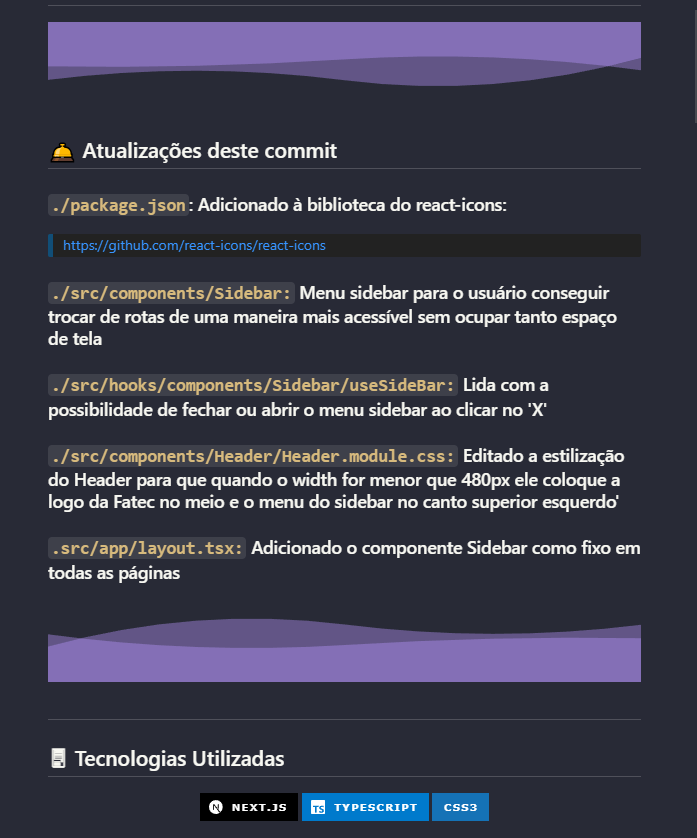
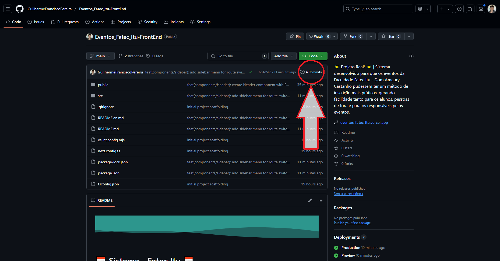
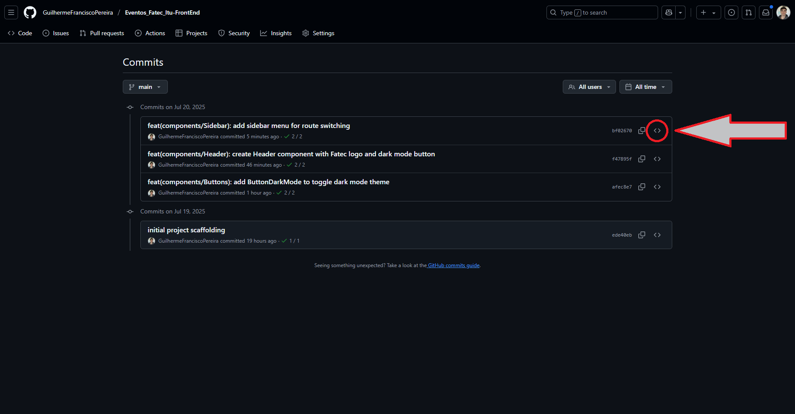
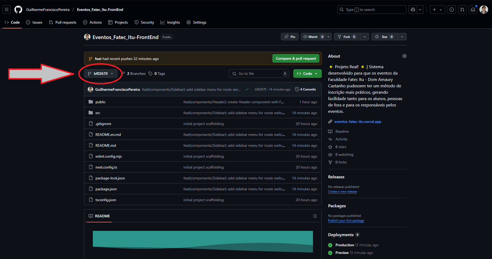
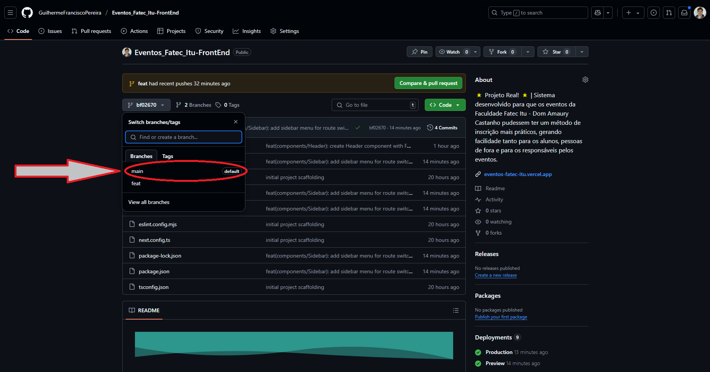

# 📅 Sistema - Fatec Itu 📅

<p align="left">
  <a href="./README.en.md">
    
  </a>
</p>

## ⭐ Repositório Front-End

## 📌 Sobre o projeto

### Este sistema foi desenvolvido para que os eventos da Faculdade Fatec Itu - Dom Amaury Castanho pudessem ter um método de inscrição mais práticos, gerando facilidade tanto para os alunos, pessoas de fora e para os responsáveis pelos eventos. Claramente este sistema também é utilizado pelos responsáveis dos eventos, para gerenciamento e controle de eventos, usuários, carrossel, categorias e etc. 

### 👥 Este sistema está sendo criado por: Guilherme Francisco Pereira como desenvolvimento de TCC / Sistema real

### ✨ Fato interessante!! Este é o único sistema desenvolvido somente por aluno que está implementado e em uso pela faculdade, tanto por alunos, professores, coordenadores, e etc!


##


## 🛎️ Atualizações deste commit

### `./src/components/Buttons/ButtonComebackUrl:` Este botão disponibiliza a opção do usuário voltar para a página anterior ou para alguma url escolhida no código, caso no código não passe as props para ele, por padrão ele volta para a url anterior a que esta no momento, se não passar a label vem por padrão como: "Voltar"


##

## 🖥 Tecnologias Utilizadas
<div align='center'>


</div>

## Versões utilizadas:
    - Next: 15.4.2
    - React: 19.1.0
    - Typescript: 5

## 🙋🏻‍♂ Como me localizar no projeto?

### Todos os arquivos de código fonte do projeto estão em: `./src`

## 🛈 Como o projeto está estruturado

- `./public:` Pasta que contém os arquivos estáticos que o Next.js serve diretamente da raiz do site, sem passar pelo pipeline de build.
    - `favicon.ico:` ícone do site exibido na aba do navegador, nos favoritos e em dispositivos móveis.
    - `assets:` diretório dentro de public para organizar recursos estáticos adicionais.
        - `images:` subpasta de assets que armazena todas as imagens do projeto (PNG, JPG, SVG), como logos, backgrounds e ícones personalizados.
            - `footer:` Pasta que irá armazenar nossas fotos para utilizar no componente Footer
            - `login:` Pasta que irá armazenar nossas fotos para utilizar nas telas de Login ( Recuperar senha e autenticação em dois fatores )
            - `readme:` Pasta que irá armazenar nossas fotos para utilizar na documentação ( README )

- `./src/middleware.ts:` Arquivo de middleware de borda que autentica usuários via cookie JWT, valida a expiração do token e, com base nas variáveis de ambiente, redireciona quem não está autenticado para rotas públicas ou quem já está autenticado para rotas privadas, impedindo acessos indevidos.`

- `./src/@Types:` Armazena as tipagens que são reutilizadas no código`
    - `CarouselTypes:` Tipagens compartilhadas da tela de Carousel
    - `CategoriesTypes:` Tipagens compartilhadas da tela de Categories
    - `EventTypes:`  Tipagens compartilhadas da tela de Eventos
    - `ParticipantsTypes:` Tipagens compartilhadas da tela de Participantes
    - `UsersTypes:` Tipagens compartilhadas da tela de Users
    - `UserJwtProps.ts:` Tipagem de usuário e suas roles.

- `./src/app:` Este é um projeto Next, caso não possua conhecimento em Next procure sobre "App Router Next" para entender mais sobre o projeto e sua estrutura de pastas e rotas! Dentro do app temos: 
  - `global.css:` Estilizações globais, importado dentro do nosso layout.tsx para passar para toda a aplicação
  - `layout.tsx:` Importa estilos globais e fontes, configura metadados (como título e descrição), e encapsula a aplicação.
    - `loading.tsx:` Este é um componente especial do Next.js para exibir algo em carregamento durante o fetch de dados ou mudança de rota, para mostrar isso ao usuário inserimos o nosso componente Loader.
  - `(pages):` Possui todas nossas rotas da aplicação, mas lembre-se, sempre que estiver dentro de parentes não será reconhecido como rota aquela pasta! Nossa páginas:
    - `(private):` Tudo que está dentro desta pasta são nossas páginas de rota privada, onde o usuário é obrigado à estar logado para poder acessar. Nela temos:
        - `Carousel`: Tela de gerenciamento do carrossel, controlas as fotos ativas no carrossel, titulo, ordem que irá aparecer cada foto no carrossel, adicionar nova foto, apagar foto, e editar fotos, tudo isso integrando-se aos hooks de API em: ./src/hooks/api/Carousel
        - `Categories:` Tela de gerenciamento de categorias, responsável por exibir a lista de categorias cadastradas e oferecer as ações de criar, editar ou excluir cada categoria, integrando-se aos hooks de API em: ./src/hooks/api/Categories/
        - `Events:` Tela de gerenciamento dos eventos, responsável por exibir a lista dos eventos cadastrados e oferecer as ações de criar, editar ou excluir cada evento, integrando-se aos hooks de API em: ./src/hooks/api/Events/
            - `Participants:` Página que mostra quais são os participantes do evento desejado, trazendo o nome, email, RA, data de inscrição e opção para marcar a presença.
        - `Users:` Tela de gerenciamento de usuários, responsável por exibir a lista de usuários cadastrados e oferecer as ações de criar, editar ou excluir cada usuário, integrando-se aos hooks de API em: ./src/hooks/api/Users/
    - `(public):` Tudo que está dentro desta pasta são nossas páginas de rota publica, onde mesmo sem estar logado o usuário pode acessar. Nela temos:
        - `page.tsx`: Nossa primeira página, também conhecido como o nosso "home", é a tela em que o usuário visualiza assim que acessa o site.
        - `EventDetail:` Tela para mostrar o evento com mais detalhes aos usuários não autenticados, possibilitando também que se inscrevam no evento
        - `Login:` Tela de login, ao acessar: /Login. Solicita e-mail e senha para o usuário acessar a plataforma, caso o e-mail e senha estejam correto o usuário troca para o stage de 'confirm' onde insere os 6 digitos enviado ao e-mail para acessar ( 2FA )
            - `ResetPassword:` Tela para o usuário trocar de senha, ao acessar: /Login/ResetPassword. Solicita primeiro o e-mail, se existir troca para a tela para informar a nova senha, confirmar, e inserir o código de 6 dígitos enviado ao e-mail.

    - `(private):` Aqui são nossas páginas de rotas privada, onde somente usuários logados podem acessar!

- `./src/components:` Onde está os componentes que serão reutilizados em diversas partes do código. Neste projeto temos os components:
    - `Buttons:`
        - `ButtonComebackUrl:` Este botão disponibiliza a opção do usuário voltar para a página anterior ou para alguma url escolhida no código, caso no código não passe as props para ele, por padrão ele volta para a url anterior a que esta no momento, se não passar a label vem por padrão como: "Voltar"
        - `ButtonDarkMode:` Botão responsável por cuidar do dark mode do site ( modo claro / escuro ).
        - `ButtonRay:` Botão que é reutilizado em diversas partes do código, alterando o texto e etc com base nas props
    - `CardEvents:` Cards que mostram os eventos aos usuários não autenticados, mostram apenas os eventos que ainda não ocorreram, nele tem breve informações como a foto, titulo, dia e horário e palestrante.
    - `CarouselComponent:` Componente do carrossel que aparece na tela inicial apresentando as imagens escolhidas pelos administradores / coordenadores.
    - `CodeInputValidation:` Componente reutilizável com 6 caixinhas para o 2fa, tanto para confirmar login quando para resetar a senha
    - `Filters:` Filtros combináveis para os eventos, filtros para filtrar por nome dos eventos, por categorias e por datas com base em inicio e fim, este componente de filtros é utilizado em CardEvents
    - `Footer:` Rodapé que contem as informações como: Endereço, número de telefone, links das áres dos alunos.
    - `Header:` Componente que fica fixo em todas as páginas pois foi inserido dentro de `layout.tsx` e fica localizado ao topo superior do site
    - `ImageCloudinary:` Responsável por renderizar imagens hospedadas no Cloudinary de forma otimizada com a tag Image do next, tornando um componente que pode ser reutilizavel em qualquer local, fazendo a imagem ficar 100% dentro do elemento pai de forma correta
    - `Inputs:`
        - `InputCheckbox:` Input de checkbox que é reutilizável no código para campos booleanos
        - `InputDefault:` Input reutilizável alterando os dados com base nas props recebidas
        - `InputImage:` Permite selecionar imagens por clique, arrastar e soltar ou colar. Exibe pré-visualização local ou de URL existente, indica visualmente quando um arquivo é arrastado e oferece botão para remover a imagem, habilitado apenas quando há arquivo selecionado
    - `Loader:` Componente que mostra ao usuário que algo está carregando
    - `Modal:` É como uma "janela" sobreposta à interface principal que bloqueia a interação com o conteúdo de fundo até ser fechada ou confirmada, usada para exibir informações críticas ou solicitações de ação específicas.
    - `Sidebar:` Menu sidebar para o usuário conseguir trocar de rotas de uma maneira mais acessível sem ocupar tanto espaço de tela
    - `Table:` Tabela reutilizável, apenas precisa passar as colunas, os dados, e as colunas ocultas no mobile. 
    - `Toast:` Exibe notificações breves. Pode ser reutilizado em diferentes cenários mudando apenas as props de mensagem e tipo (Success, Alert, Error).

- `./src/hooks:` Armazenaremos aqui os nossos hooks personalizados com as partes lógicas da aplicação, nós separamos os nossos hooks, por tipos como: pages, components e api.
    - `api`:` Aqui ocorrem os métodos HTTP fazendo requisições para o back-end
        - `Auth:` Todas as requisições para o back-end nas rotas de /auth/
            - `Get:` Requisições GET nas rotas de /auth/
                - `getMe:` Utilizado para pegar com o back-end os dados do usuário, como nome, e-mail, role e etc.
            - `Post:` Requisições POST nas rotas de /auth/
                - `useLogin:` Requisições para o back-end para fazer a solicitação de login (gerar código 2fa) e confirmar código 2fa para entrar na conta
                - `useLogout:` Bate na rota de logout para permitir o usuário a se deslogar 
                - `useResetPassword:` Requisições para o back-end para fazer a solicitação de troca de senha (gerar código 2fa) e confirmar código 2fa para trocar a senha

        - `Carousel:` Todas as requisições para o back-end nas rotas de /carousel/
            - `Delete:` Requisições DELETE nas rotas de /carousel/delete/:id
                - `useDeleteCarousel.ts:` Hook que encapsula a lógica de remover um slide, enviando DELETE com proteção CSRF e tratando falhas para exibir mensagens de erro.
            - `Get:` Requisições GET nas rotas de /carousel
                - `useGetAllCarousels.ts:` Hook responsável por carregar todos os slides, gerenciar estados de “loading” e “error” e expor uma função refetch() para recarregar os dados após operações de mutação.
            - `Post:` Requisições POST nas rotas de /carousel/create
                - `useCreateCarousel.ts:` Hook que constrói um FormData com título, ordem, status e imagem, faz a chamada POST com CSRF e dispara toasts de sucesso ou falha.
            - `Patch:` Requisições PATCH nas rotas de /carousel/patch/:id
                - `useEditCarousel.ts:` Hook para atualização completa de um slide (nome, ordem, ativo, imagem), alternando entre multipart/form-data e JSON conforme a presença de arquivo e incluindo CSRF e tratamento de exceções.
                - `useToggleActiveCarousel.ts:` Aqui bate na rota /carousel/patch/toggle/ é um hook dedicado a inverter apenas o campo isActive via PATCH JSON com CSRF, exibindo toast indicando “ativado” ou “desativado”.

        - `Categories:` Todas as requisições para o back-end nas rotas de /categories/
            - `Delete:` Requisições DELETE nas rotas de /categories/delete/
                - `useDeleteCategory.ts:` Hook que encapsula a lógica de requisição HTTP para excluir uma categoria específica, enviando um DELETE protegido por CSRF e garantindo o tratamento de erros para informar falhas de exclusão.
            - `Get:` Requisições GET nas rotas de /categories/
                - `useGetAllCategories.ts:` Hook que realiza a recuperação de toda a lista de categorias via requisição GET, gerenciando estados de carregamento, erro e permitindo refetch após operações de CRUD.
            - `Patch:` Requisições PATCH nas rotas de /categories/patch/:id
                - `useEditCategory.ts:` Hook responsável por enviar atualizações parciais de dados de uma categoria existente através de uma requisição PATCH com CSRF, permitindo modificar apenas o nome da categoria.
            - `Post:` Requisições POST nas rotas de /categories/post/
                - `useCreateCategory.ts:` Hook para criar uma nova categoria no sistema via requisição POST, construindo o payload tipado com o nome da categoria e incluindo proteção CSRF para garantir a segurança da operação.

        - `Events:` Todas as requisições para o back-end nas rotas de /events/
            - `Delete:` Requisições DELETE nas rotas de /event/delete/:id
                - `useDeleteEvent.ts:` Hook que encapsula a lógica de remover um evento, enviando DELETE com proteção CSRF e tratando falhas para exibir mensagens de erro.
            - `Get:` Requisições GET nas rotas de /event
                - `useGetAllevents.ts:` Responsável por carregar todos os eventos.
                - `useGetAvailabilityDates.ts:` Responsável por pegar do banco de dados todas os dias que possuem pelo menos 1 horário disponivel no local escolhido para o evento, evitando de ter dois eventos no mesmo local.
                - `useGetAvailabilityTimes.ts:` Responsável por pegar do banco de dados todas os horários disponiveis para não ocorrer que um evento sobreponha outro no mesmo dia, horario e local..
            - `Patch:` Requisições PATCH nas rotas de /event/patch/:id
                - `useEditEvent.ts:` Hook para editar um evento por completo, podendo substituir os valores.
            - `Post:` Requisições POST nas rotas de /event/create
                - `useCreateEvent.ts:` Responsável por criar um novo evento, fazendo a requisição para o back-end passando os valores corretos
        
        - `Participants:` Todas as requisições para o back-end nas rotas de /participants/
            - `Get:` Requisições GET nas rotas de /participants/
                - `useGetAllParticipants:` Retorna todos os participantes de um determinado evento com base no id do evento que vem através da props
            - `Patch:` Requisições PATCH nas rotas de /participants/patch/:id
                - `useEditParticipants:` Atualiza o campo isPresent ( boolean ) da tabela Participant com base no ID do evento e dentro deste evento o ID do participante, assim atualizando conforme o usuário atualiza o checkbox no front
            - `Post:` Requisições POST nas rotas de /participants/create
                - `useCreateParticipant:` Responsável por adicionar uma nova pessoa à um evento especifico, fazendo a requisição para o back-end
        
        - `Users:` Todas as requisições para o back-end nas rotas de /users/
            - `Delete:` Requisições DELETE nas rotas de /users/delete/
                - `useDeleteUser.ts:` Hook que encapsula a lógica de requisição HTTP para excluir um usuário específico, enviando um DELETE protegido por CSRF e garantindo o manuseio de erros para informar falhas de exclusão.
            - `Get:` Requisições GET nas rotas de /users/
                - `useGetAllUsers.ts:` Hook que realiza a recuperação de toda a lista de usuários via requisição GET, gerenciando estados de carregamento, erro e atualizando automaticamente a rota caso o usuário não esteja autorizado.
            - `Patch:` Requisições PATCH nas rotas de /users/patch/
                - `useEditPersonalProfile:` Hook que possibilita trocar o nome e a foto do próprio perfil.
                - `useEditUser.ts:` Hook responsável por enviar atualizações parciais de dados de um usuário existente através de uma requisição PATCH com CSRF, permitindo modificar nome, e-mail, senha ou nível de acesso.
            - `Post:` Requisições POST nas rotas de /users/post/
                - `useCreateUser.ts:` Hook para criar um novo usuário no sistema via requisição POST, construindo o payload tipado com nome, e-mail, senha e cargo, e incluindo proteção CSRF para garantir a segurança da operação.

    - `components:`
        - `Buttons`: Partes lógicas dos nossos componentes de botões
            - `useButtonDarkMode:` Responsável por lidar com o dark mode, mudando o tema com base no click do usuário!
        - `CarouselComponent:`
            - `useCarouselComponent:` Parte lógica do carrossel, lida com o passar de imagens automático ou manual, clique nas bolinhas que estão centralizadas na parte inferior e etc.
        - `CodeInputValidation:` 
            - `useCodeInputValidation:` Lida com a parte lógica dos inputs da autenticação em dois fatores
        - `Sidebar:`
            - `useSideBar:` Lida com a possibilidade de fechar ou abrir o menu sidebar ao clicar no 'X'
    - `pages` Lógicas das páginas, arquivos page.tsx que fica dentro de app
        - `(private):` Lógicas das páginas, arquivos page.tsx que fica dentro de app -> (pages/private)
            - `/Events:` Partes lógicas da rota /Events
                - `/useEventForm:` Todas as partes lógicas da tela de criação ou edição de eventos
        - `(public):` Lógicas das páginas, arquivos page.tsx que fica dentro de app -> (pages/public)
            - `/Login:` Partes lógicas da rota /Login
                - `/useYeti:` Controla o yeti para lidar com a animação de "interagir" com os inputs

- `./src/stores:` Stores para a biblioteca Zustand
    - `ZustandWrapper:` Junta todos os components do Zustand para compartilharmos de uma única forma para o layout.tsx
    - `useModalStore:`
        - `index.ts:` Controlar a exibição e limpa os dados do modal da aplicação.
    - `useToastStore:`
        - `index.ts:` Responsável por orquestrar a exibição, animação de progresso e fechamento automático dos toasts em toda a aplicação.
    - `useUserStore:`
        - `index.ts:` Para setar o usuário na aplicação

- `./src/utils:` Pasta que agrupa funções utilitárias genéricas, sem dependência de componentes específicos, usadas em toda a aplicação para operações comuns de DOM e exportação.
    - `downloadSectionAsPdf.ts:` Função que captura uma seção da página (identificada por ID) e gera um arquivo PDF com toda a sua extensão, incluindo quebras de página em A4. Serve para permitir ao usuário baixar qualquer parte da interface como documento portátil.
    - `printSection.ts:` Função que clona e prepara uma seção da página (identificada por ID) para impressão, centralizando-a e aplicando margens, mantendo cores exatas do cabeçalho da tabela. Serve para acionar o diálogo de impressão do navegador e imprimir apenas o conteúdo desejado.


## ❔ Como rodar o projeto na minha máquina?

- Antes de tudo, você precisa ter o Git instalado no seu computador. O Git é uma ferramenta que permite clonar e gerenciar repositórios de código.
    - Windows: Baixe o Git <a href="https://git-scm.com/download/win" target="_blank">aqui</a> e siga as instruções de instalação.
    - macOS: Você pode instalar o Git <a href="https://git-scm.com/download/mac" target="_blank">aqui</a> ou usando o Homebrew com o comando brew install git:
        ```bash
        brew install git
        ```
        
    - Linux: Use o gerenciador de pacotes da sua distribuição, por exemplo para Debian/Ubuntu:
        ```bash
        sudo apt install git
        ```
        

- Abra o terminal (no Windows, você pode usar o Git Bash, que é instalado junto com o Git).

- Navegue até o diretório onde deseja armazenar o projeto.

- Execute o comando para clonar o repositório:

    ```bash
    git clone https://github.com/GuilhermeFranciscoPereira/Eventos_Fatec_Itu-Front-End.git
    ```

- Após clonar o repositório, navegue até a pasta do projeto
    ```bash
    cd Eventos_Fatec_Itu-Front-End
    ```

- Agora você pode abrir os arquivos do projeto com seu editor de texto ou IDE preferido. Exemplo do vsCode: 
    ```bash
    code .
    ```

- 🚨 Não esqueça que para não ocorrer erros no código ao clonar ele, você deve fazer o comando abaixo 🚨
    ```bash
    npm i   
    ```

- Ao ter o projeto na sua máquina você deve abrir o site. Para isso siga os passos abaixo:
    - Abra o terminal e escreva o código abaixo para iniciar o site:
      ```bash
      npm run dev
      ```

    - ⚠️ Lembre-se de criar o arquivo .env com base em tudo que contem no arquivo: `.env.example`

##

## ⚠️ Informações importantes sobre o projeto ⚠️

### 📝 Todos os commits do projeto possuem um readme detalhado do que foi feito naquele commit como mostrado de exemplo na imagem abaixo, então caso deseje ver o processo de criação do código viaje pelos commits e veja as informações!

## 

##

### ❔ Como fazer isso? 

### 👇🏻 Para você ver o processo de criação e o que foi feito em cada commit siga o passo-a-passo:

##

### 1 - Nesta mesma guia em que você está, suba a tela até encontrar embaixo do botão verde o local em que está circulado da foto abaixo e então clique nele


##

### 2 - No lado direito dos commits você encontra um simbolo de <> como está circulado na foto abaixo e então você clica neste simbolo e irá encontrar como o código estava naquele momento e o readme detalhado daquele momento!


##

### 3 - Depois de encontrar tudo que deseja, caso queira voltar o commit atual, você irá clicar no local em que a imagem a baixo circula:


##

### 4 - E então clique em main ( onde está circulado na foto abaixo ) e voltará para o último commit realizado!


##

## 🎉 É isso! Esse é o sistema da Fatec Itu para eventos, caso tenha ficado com alguma dúvida ou deseje complementar algo diretamente comigo você pode estar entrando em contato através do meu LinkedIn:
> Link do meu LinkedIn: <a href="https://www.linkedin.com/in/guilherme-francisco-pereira-4a3867283" target="_blank">https://www.linkedin.com/in/guilherme-francisco-pereira-4a3867283</a>

### 🚀 Obrigado pela atenção e espero que tenha gostado do que tenha visto aqui, que tal agora dar uma olhada nos meus outros repositórios? 👋🏻

#

### ❤️ Créditos:

#### Créditos primários à Faculdade de Tecnologia de Itu por ceder seu nome, e utilizar o sistema em seu ambiente!
> <a href="https://fatecitu.cps.sp.gov.br" target="_blank">https://fatecitu.cps.sp.gov.br</a>

#### Créditos dos emojis: 
> <a href="https://emojipedia.org" target="_blank">https://emojipedia.org</a>

#### Créditos dos badges: 
> <a href="https://shields.io" target="_blank">https://shields.io</a>